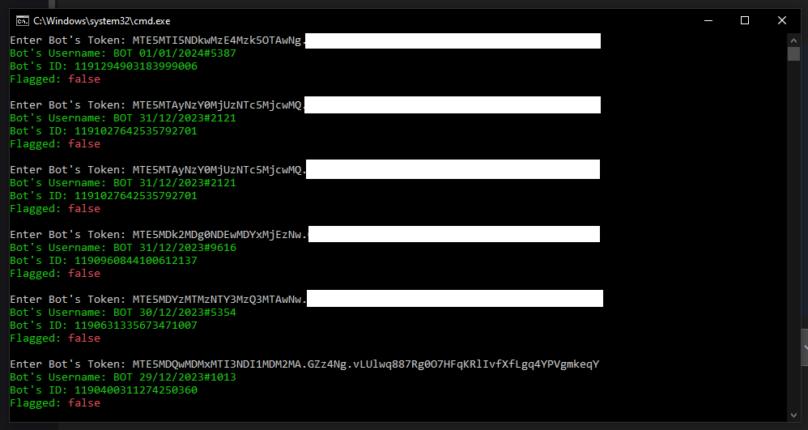

# Installation

### Windows

1. You have to download and install node.js first: https://nodejs.org/en/download/ .
2. Then, you have to run `install.bat` file.
3. Finally, run `start.bat` file.

# Screenshot

# Discord

    
    
@mh8.

